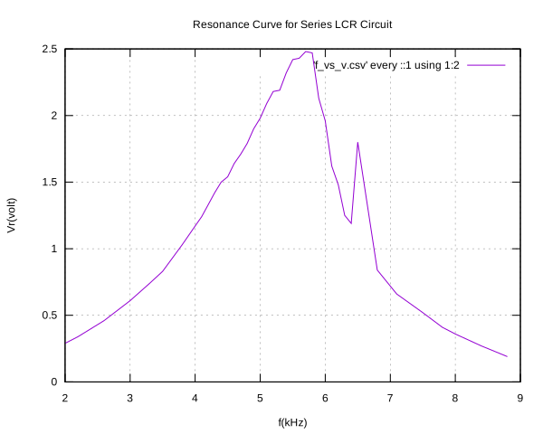

## Experimental dataset of resonant series LCR circuit

* L = 10mH
* C = 100000pF
* R = 100ohm

f(kHz)  |  Vr(volt)
--------|----------
2.0     |  0.29
2.2     |  0.34
2.6     |  0.46
3.0     |  0.61
3.3     |  0.74
3.5     |  0.83
3.8     |  1.03
4.0     |  1.17
4.1     |  1.24
4.2     |  1.33
4.3     |  1.42
4.4     |  1.50
4.5     |  1.54
4.6     |  1.64
4.7     |  1.71
4.8     |  1.79
4.9     |  1.90
5.0     |  1.98
5.1     |  2.09
5.2     |  2.18
5.3     |  2.19
5.4     |  2.32
5.5     |  2.42
5.6     |  2.43
5.7     |  2.48
5.8     |  2.47
5.9     |  2.13
6.0     |  1.96
6.1     |  1.62
6.2     |  1.48
6.3     |  1.25
6.4     |  1.19
6.5     |  1.8
6.8     |  0.84
7.1     |  0.66
7.5     |  0.52
7.8     |  0.41
8       |  0.36
8.4     |  0.27
8.8     |  0.19
-----

